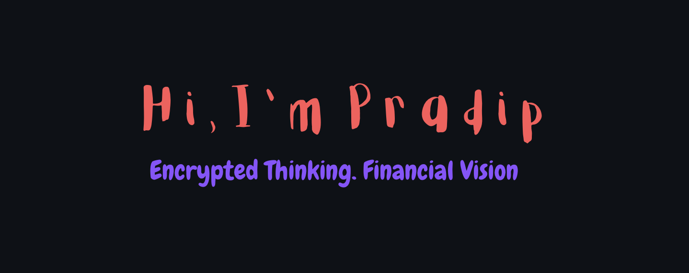

 
 
 
 
 
 
 
 
 
 
 
 

## Main Projects
A curated list of my top GitHub projects combining cybersecurity, cloud, and automation:

---

### [Cybersecurity Analyst Roadmap](https://github.com/pradip676/Roadmap-to-Cybersecurity-Analyst)
A structured, GitHub-based roadmap with curated study paths, certifications, tools, and hands-on project ideas for aspiring cybersecurity analysts.

---

### [UESOP-X](https://github.com/pradip676/UESOP-X)
A unified cybersecurity platform integrating SIEM (Splunk), MITRE ATT&CK mapping, threat intelligence, and vulnerability scanning (Nessus-style) to mimic real-world SOC workflows.

---

### [VulnX](https://github.com/pradip676/VulnX)
Python-based vulnerability scanner using Nmap and CVE lookup via Vulners API, with interactive CLI, HTML report generation, and PDF export — inspired by Nessus.

---

### [OverTheWire: Bandit Walkthroughs](https://github.com/pradip676/OverTheWire-Bandit)
Step-by-step solutions to all 34 levels of OverTheWire: Bandit — demonstrating Linux basics, file manipulation, and privilege escalation techniques.
---

### [HackDome Live CTF](https://github.com/pradip676/HackDome-Live-CTF)
A live Capture-the-Flag WordPress platform with 2FA, Stripe integration, phishing lab simulations, and secure AWS deployment — built for cybersecurity practice.
---

### [Enhanced JWKS Auth Server](https://github.com/pradip676/Enhanced-JWKS-Auth-Server)
Flask-based JWT authentication server with RSA key management, AES-encrypted private key storage, Argon2 password hashing, logging, and optional rate limiting.
---

### [AWS Image Label Generator](https://github.com/pradip676/AWS-Image-Label-Generator)
A simple AWS Lambda-based tool that uses Rekognition to auto-label uploaded images and store metadata in S3 and DynamoDB — showcasing serverless architecture.

---

  <a href="https://www.linkedin.com/in/pradipsapkota01/">LinkedIn</a> |
  <a href="https://github.com/pradip676">GitHub</a> |
  <a href="mailto:pradipsapkota279@gmail.com">Email</a>

