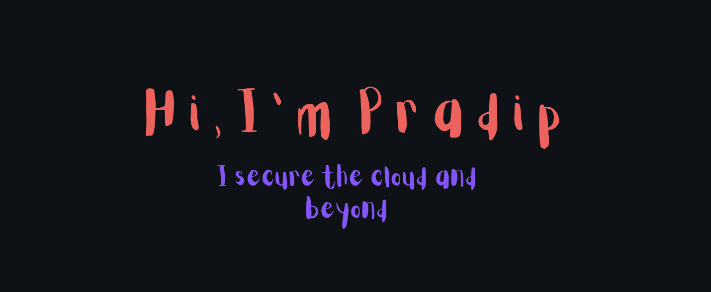

 
 
 
 
 
 
 
 
 
 
 
 

<h2 align="center"> 👨‍💻 WHAT'S MY STORY</h2>

  <samp>A CS student with participation in international competitions and professional experience in high-paced tech outsourcing companies and big-scale companies, possessing decent knowledge of the software development lifecycle and a good understanding of algorithms and data structures.
  </samp>
   

<h2 align="center"> 🔭 TOOLS I USE</h2>

  &nbsp;&nbsp;&nbsp;
  &nbsp;&nbsp;&nbsp;
  &nbsp;&nbsp;&nbsp;
  &nbsp;&nbsp;&nbsp;
  &nbsp;&nbsp;&nbsp;
   
   

<h2  align="center">📫 FIND ME ON:</h2>

  &nbsp;&nbsp;&nbsp;&nbsp;
    

